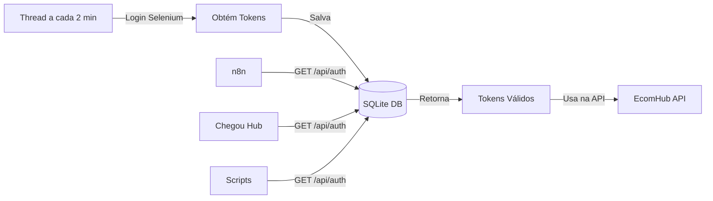

# 🔐 Sistema Centralizado de Tokens com Banco de Dados

## 📋 Visão Geral

Sistema automatizado que mantém tokens EcomHub sempre frescos em banco de dados SQLite, permitindo que múltiplos sistemas (n8n, Chegou Hub, etc) obtenham tokens válidos instantaneamente.

## 🔄 Como Funciona

### 1. Thread em Background (Automático)
```
A cada 2 minutos:
└── Login via Selenium
    └── Obtém tokens frescos
        └── Salva no banco SQLite
            └── Tokens prontos para uso
```

### 2. Consumo dos Tokens
```
n8n/Chegou Hub/Outros → GET /api/auth → Lê do Banco → Tokens instantâneos
```

## 🎯 Endpoints Disponíveis

### GET `/api/auth`
Retorna tokens válidos do banco de dados.

**Resposta de Sucesso (200):**
```json
{
  "success": true,
  "cookies": {
    "token": "eyJ...",
    "e_token": "eyJ...",
    "refresh_token": "eyJ..."
  },
  "cookie_string": "token=eyJ...;e_token=eyJ...;refresh_token=eyJ...",
  "headers": {
    "Accept": "*/*",
    "Content-Type": "application/json",
    ...
  },
  "timestamp": "2024-11-08T15:30:00",
  "expires_in": 120,  // segundos restantes
  "expires_at": "2024-11-08T15:33:00",
  "message": "Tokens válidos. Expira em 120 segundos"
}
```

**Resposta de Erro (503) - Sem tokens:**
```json
{
  "detail": "Tokens não disponíveis. Aguarde a sincronização automática (executa a cada 2 minutos)"
}
```

### GET `/api/auth/status`
Verifica o status do sistema de tokens.

**Resposta:**
```json
{
  "status": "active",
  "has_tokens": true,
  "expires_in": 120,
  "last_update": "2024-11-08 15:30:00",
  "sync_enabled": true,
  "sync_interval": "2 minutos"
}
```

## 💾 Estrutura do Banco de Dados

### Tabela: `tokens`
| Campo | Tipo | Descrição |
|-------|------|-----------|
| id | INTEGER | Sempre 1 (registro único) |
| token | TEXT | Token principal JWT |
| e_token | TEXT | Token extra |
| refresh_token | TEXT | Token de refresh |
| cookies | TEXT | JSON com todos os cookies |
| expires_at | TEXT | Timestamp de expiração |
| updated_at | TEXT | Última atualização |

## 🚀 Configuração no Railway

### Variáveis de Ambiente

```env
# OBRIGATÓRIAS
TOKEN_SYNC_ENABLED=true
ECOMHUB_EMAIL=seu_email@exemplo.com
ECOMHUB_PASSWORD=sua_senha

# OPCIONAIS
TOKEN_SYNC_INTERVAL_MINUTES=2  # padrão é 2
```

## 📦 Integração com Sistemas Externos

### Para n8n
```javascript
// Node HTTP Request
{
  "method": "GET",
  "url": "https://sua-api.railway.app/api/auth",
  "responseType": "json"
}

// Use os tokens retornados para chamar EcomHub diretamente
```

### Para Chegou Hub
```python
import requests

# Buscar tokens
response = requests.get("https://sua-api.railway.app/api/auth")
tokens = response.json()

# Usar com a API do EcomHub
headers = {
    "Cookie": tokens["cookie_string"],
    **tokens["headers"]
}
ecomhub_response = requests.get(
    "https://api.ecomhub.app/api/orders",
    headers=headers
)
```

### Para Python/Scripts
```python
import requests
import time

def get_fresh_tokens():
    """Obtém tokens frescos do servidor centralizado"""
    resp = requests.get("https://sua-api.railway.app/api/auth")
    if resp.status_code == 200:
        return resp.json()
    elif resp.status_code == 503:
        # Aguardar sincronização
        print("Aguardando sincronização...")
        time.sleep(30)
        return get_fresh_tokens()
    else:
        raise Exception(f"Erro: {resp.text}")

# Usar tokens
tokens = get_fresh_tokens()
print(f"Tokens válidos por {tokens['expires_in']} segundos")
```

## 🔍 Monitoramento

### Verificar se há tokens disponíveis:
```bash
curl https://sua-api.railway.app/api/auth/status
```

### Obter tokens:
```bash
curl https://sua-api.railway.app/api/auth
```

## ⚡ Vantagens do Sistema

1. **Resposta Instantânea**: Tokens já prontos no banco
2. **Zero Login por Request**: Login apenas a cada 2 minutos
3. **Multi-consumidor**: n8n, Chegou Hub, scripts, etc
4. **Alta Disponibilidade**: Thread resiliente com retry
5. **Simples Integração**: Apenas um GET request

## 🛠️ Troubleshooting

### "Tokens não disponíveis"
- Aguarde até 2 minutos para primeira sincronização
- Verifique se `TOKEN_SYNC_ENABLED=true`
- Verifique logs do servidor para erros de login

### "Tokens expirados"
- Normal se a thread estiver parada
- Aguarde próxima sincronização (máximo 2 minutos)
- Verifique logs para ver se há falhas de login

### "Erro ao obter tokens"
- Verifique se o banco está acessível
- Confirme que o arquivo `tokens.db` existe
- Revise logs para erros específicos

## 📊 Fluxo Completo



## 🎯 Casos de Uso

1. **n8n Workflows**: Busca tokens antes de executar automações
2. **Chegou Hub**: Obtém tokens para análises em tempo real
3. **Scripts Batch**: Processa dados usando tokens centralizados
4. **Monitoramento**: Verifica saúde do sistema via `/api/auth/status`
5. **Integrações**: Qualquer sistema que precise acessar EcomHub

## 🔐 Segurança

- Tokens salvos localmente no servidor
- SQLite com acesso apenas local
- Expiração automática após 3 minutos
- Renovação proativa (2 min) antes de expirar
- Sem exposição de credenciais nos endpoints